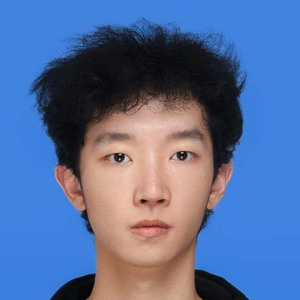
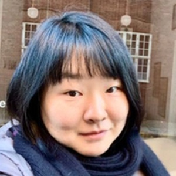
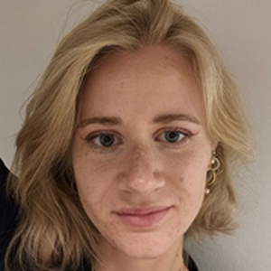
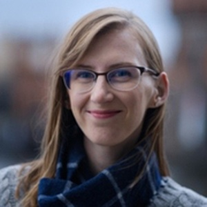
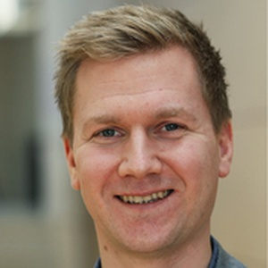

Welcome to the **Anti-Backdoor (Anti-BAD) Challenge**, an IEEE SaTML 2026 competition dedicated to advancing the trustworthiness of **post-trained large language models (LLMs)**.

LLMs have become the rising stars of our time, powering a wide range of applications. As fine-tuning and deploying large models from scratch become increasingly costly, many practitioners now rely on post-trained models shared by others. This convenience, however, raises a critical question: **can we trust these models to behave safely?**

One of the most serious risks is the **backdoor attack**, where a model behaves normally on clean inputs but produces malicious outputs when a hidden trigger appears. The Anti-BAD Challenge invites participants to design **effective and practical defense methods** that can mitigate such hidden behaviors **without access to the training history or backdoor knowledge**, while maintaining strong task performance.

---

## News

- **October 21, 2025**: Competition opens for registration on [**Codabench**](https://www.codabench.org/competitions/11188/).
- **August 31, 2025**: Anti-BAD Challenge accepted as part of IEEE SaTML 2026.  
- **Join our [Discord community](https://discord.gg/x8GqKDF2Rb)** for announcements, discussions, and Q&A.

---

## Overview

The Anti-BAD Challenge simulates a realistic setting where users download post-trained models from public sources without knowing their training history. The goal is to produce a **deployable model** that preserves utility while suppressing malicious backdoor behavior during inference.

The challenge includes **three tracks**, each representing a distinct application scenario:

* **Generation Track**
* **Classification Track**
* **Multilingual Track**

Each track contains **two tasks**, for a total of six. Every task provides multiple post-trained models that reflect real-world model-sharing practices. Participants may defend individual models or develop approaches that integrate information from several models to improve robustness.  
The models are based on popular architectures such as **Llama** and **Qwen**.

Detailed setup instructions and starter kit information are provided in the [**Getting Started**](/startkit/) page.
For full task descriptions, evaluation details, and submission guidelines, visit the [**Challenge**](/challenge/) page.

---

## Important Dates

- **Competition registration opens:** October 21, 2025  
- **Development phase starts:** November 7, 2025  
- **Test phase starts:** February 1, 2026  
- **Test phase ends:** February 7, 2026  
- **Final evaluation and ranking announcement:** February 8, 2026  

---

## Organizers

  

    <article class="organizer-card">
      
      <a class="organizer-name" href="https://weijun-l.github.io/" target="_blank" rel="noopener">Weijun Li</a>
    </article>
    <article class="organizer-card">
      
      Jinrui Yang
    </article>
    <article class="organizer-card">
      
      <a class="organizer-name" href="https://ansharora7.github.io/" target="_blank" rel="noopener">Ansh Arora</a>
    </article>
    <article class="organizer-card">
      
      <a class="organizer-name" href="https://vbn.aau.dk/en/persons/yiyic" target="_blank" rel="noopener">Yiyi Chen</a>
    </article>
    <article class="organizer-card">
      
      <a class="organizer-name" href="https://vbn.aau.dk/en/persons/jmba" target="_blank" rel="noopener">Josephine Bakka</a>
    </article>
    <article class="organizer-card">
      
      <a class="organizer-name" href="https://xlhex.github.io/" target="_blank" rel="noopener">Xuanli He</a>
    </article>
    <article class="organizer-card">
      
      <a class="organizer-name" href="https://vbn.aau.dk/en/persons/hcle" target="_blank" rel="noopener">Heather Lent</a>
    </article>
    <article class="organizer-card">
      
      <a class="organizer-name" href="https://vbn.aau.dk/en/persons/jbjerva" target="_blank" rel="noopener">Johannes Bjerva</a>
    </article>
    <article class="organizer-card">
      
      <a class="organizer-name" href="https://mark-dras.github.io/" target="_blank" rel="noopener">Mark Dras</a>
    </article>
    <article class="organizer-card">
      
      <a class="organizer-name" href="https://xuqiongkai.github.io/" target="_blank" rel="noopener">Qiongkai Xu</a>
    </article>
  

---

## Contact

For questions or inquiries, please reach us via:
- **Email:** [antibad-competition-satml-2026@googlegroups.com](mailto:antibad-competition-satml-2026@googlegroups.com)
- **Discord:** [https://discord.gg/x8GqKDF2Rb](https://discord.gg/x8GqKDF2Rb)

---

## Acknowledgments

We gratefully acknowledge **Google Cloud Research Credits Program** for their support in providing computing infrastructure for this competition.